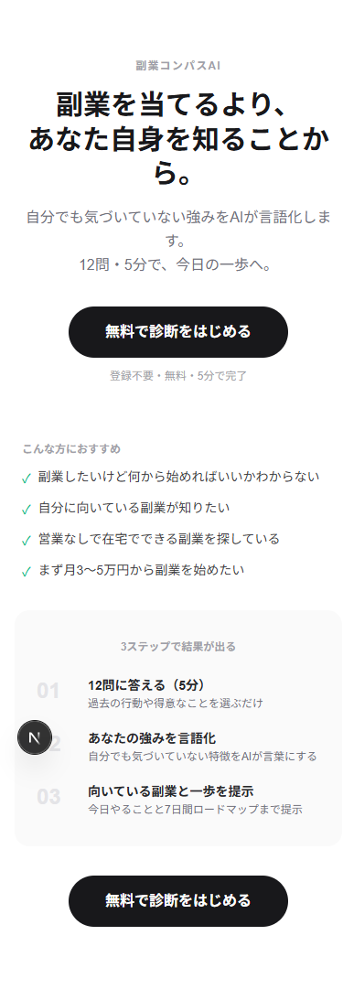
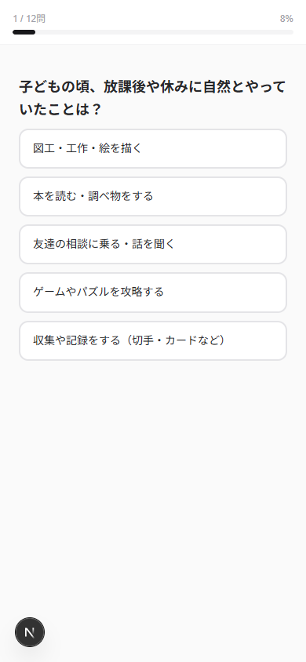
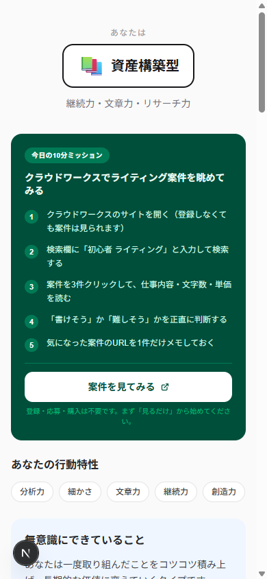
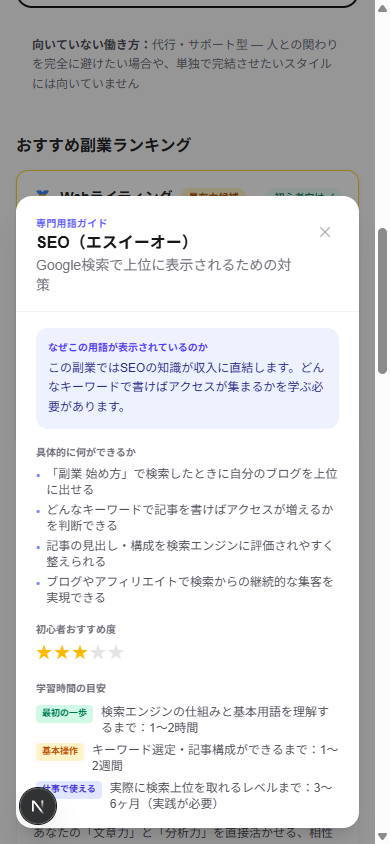

# 副業コンパスAI — Side Hustle Compass AI

**副業初心者が「何をすればいいか分からない」状態から、自分の特徴を知り、最初の10分の行動まで進めるWebサービスです。**

「稼げる副業を断定する」サービスではなく、「自分に合いそうな入口と、最初の一歩を整理する」サービスです。

---

## デモ

**[→ デモを見る（https://side-hustle-compass-ai.vercel.app/）](https://side-hustle-compass-ai.vercel.app/)**

登録不要・完全無料・スマホ対応

---

## サービス概要

副業を始めたいけど何から手をつければいいか分からない人を対象にした、行動特性診断Webサービスです。

12問の選択式質問に答えるだけで、本人も気づいていない行動特性・強みを言語化し、向いている働き方タイプと副業候補を提示します。診断結果で終わらず、「今日の10分ミッション」まで一つの流れとして案内します。専門用語や外部サービス名は、その場で確認できる初心者ガイド付きです。

| 項目 | 内容 |
|------|------|
| 対象ユーザー | 副業を始めたい初心者・AI初心者・営業が苦手な方 |
| 所要時間 | 約5分 |
| 価格 | 完全無料・登録不要 |
| 動作環境 | ブラウザのみ（スマホ・PC対応） |

---

## 開発背景

副業情報は増え続けているにもかかわらず、初心者が実際に動き出せていない理由には共通のパターンがあります。

- 選択肢が多すぎて、何を選べばいいか分からない
- 「得意なことを活かせばいい」と言われても、自分の得意が言語化できていない
- 診断結果を見ても、「次に何をするか」が具体的に分からない
- 情報は十分にあるのに、最初の行動が曖昧で止まってしまう

このサービスでは、以下の流れを一気通貫で設計しました。

```
診断（12問）
  ↓
行動特性・強みの言語化
  ↓
向いている働き方タイプの提示
  ↓
副業候補とのマッチング
  ↓
今日の10分ミッション
```

「副業を選ぶ」ではなく、「自分を知り、最初の一歩を決める」ことを目的としています。

---

## 主な機能

初心者が迷わず進められるよう、各機能は「情報を増やす」ではなく「判断を減らす」ために設計しています。

| 機能 | 説明 |
|------|------|
| 12問の診断 | 選択式のみ・文章入力なし・約5分で完了 |
| 行動特性タグの抽出 | 「文章力」「継続力」「細かさ」など15種類のタグを回答から自動抽出 |
| 5種類の働き方タイプ判定 | タグ×スコアリングで最も近いタイプを判定し、向いていない理由も提示 |
| 18種類の副業候補とのマッチング | タイプ一致・タグ一致・苦手タグペナルティで順位付け |
| おすすめ副業ランキング | 上位5件を適性度★・初心者向け判定・収益目安・継続負担・AI相性とともに表示 |
| おすすめしない副業と理由 | タイプ特性に基づいた個別化された理由で2件を明示 |
| 強みの言語化 | タイプ×タグの組み合わせから「無意識にできていること」を文章で出力 |
| 今日の10分ミッション | 登録・購入・応募なしで今日できる具体的な手順を5ステップで提示 |
| 初心者が詰まりやすいポイントと対処法 | よくある不安ごとに「それでも大丈夫な理由」を提示 |
| 7日間ロードマップ | 最初の1週間の行動計画をDay 1〜7で提示 |
| AIに相談するためのプロンプト | ChatGPT向けのコピー可能なプロンプトを1件ずつ提示 |
| 専門用語・サービス・AIツールの初心者ガイド | GAS・n8n・SEO・MEO・LP・API等をタップで解説表示 |
| 外部サービスへの行動リンク | ミッション内から各サービスを直接開けるリンクを配置 |

---

## 診断ロジック

単純な性格診断ではなく、「タグ＋プロファイルベース」のルール設計です。

```
回答
  ↓
行動特性タグを蓄積（15種類 × 重みスコア）
  ↓
ユーザープロファイル生成（lib/tagging.ts）
  ↓
働き方タイプをスコアリング（lib/scoring.ts）
  ↓
副業候補とマッチング（lib/matching.ts）
  ↓
診断結果と行動プランを生成（lib/result-generator.ts）
```

### マッチングスコア計算式

```
スコア = タイプ一致ボーナス（+20）
       + タグ一致スコア（タグ値 × 2、マッチタグ分累積）
       - 苦手タグペナルティ（-15 × 一致苦手タグ数）
```

### 設計上の分離原則

診断ロジック・副業ランキングと、外部リンク・アフィリエイト設定は**完全に独立したファイル**で管理しています。

| ファイル | 役割 |
|----------|------|
| `lib/matching.ts` `lib/scoring.ts` | 診断・ランキングロジック（リンク情報を参照しない） |
| `lib/external-services.ts` | 外部サービスURL・アフィリエイトURL管理（診断に影響しない） |

広告の有無によって診断結果やランキング順位が変わることはありません。

---

## 働き方タイプ（5種類）

| タイプ | 特徴 |
|--------|------|
| 資産構築型 | コツコツと積み上げ、時間が経つほど資産が増える働き方が向いている |
| 受託スキル型 | 細かさと丁寧さでクライアントから信頼を得る働き方が向いている |
| 販売・コンテンツ型 | 一度作ったコンテンツが繰り返し売れる仕組みを作る働き方が向いている |
| 代行・サポート型 | 相手の課題を一緒に解決することにやりがいを感じる働き方が向いている |
| 自動化・仕組み化型 | 一度作った仕組みが継続的に価値を生み出す働き方が向いている |

---

## 使用技術

| 項目 | 技術・バージョン |
|------|----------------|
| フレームワーク | Next.js 16.2.10（App Router） |
| UI ライブラリ | React 19.2.4 |
| 言語 | TypeScript 5系（strict mode） |
| スタイリング | Tailwind CSS v4 |
| テスト | Vitest 4.1.9 |
| デプロイ | Vercel |
| データ保持 | localStorage（DB・登録不要） |

---

## ディレクトリ構成

```
side-hustle-compass-ai/
├── app/                   # Next.js App Router（トップ・診断・結果の3画面）
├── components/
│   ├── diagnosis/         # 診断画面コンポーネント（質問・選択肢）
│   ├── result/            # 結果画面コンポーネント（ランキング・ミッション等）
│   └── ui/                # 共通UIコンポーネント（用語ガイドモーダル等）
├── data/                  # 副業データ・質問・用語・働き方タイプ（静的JSON的TS）
├── lib/                   # 診断ロジック・外部サービス管理・型定義
└── docs/                  # 要件定義・画面設計・診断ロジック詳細
```

---

## ローカル起動方法

```bash
# リポジトリをクローン
git clone https://github.com/nyanjii-hub/side-hustle-compass-ai.git
cd side-hustle-compass-ai

# 依存関係のインストール
npm install

# 開発サーバーの起動
npm run dev
```

ブラウザで `http://localhost:3000` を開いてください。

---

## テスト・品質確認

```bash
# テスト実行（21件）
npm test

# Lint チェック
npm run lint

# プロダクションビルド確認
npm run build
```

### テストカバレッジ

| テストファイル | 件数 | 対象 |
|--------------|------|------|
| `lib/tagging.test.ts` | 9 | タグ付与・プロファイル生成 |
| `lib/scoring.test.ts` | 6 | スコアリング・タイプ判定 |
| `lib/matching.test.ts` | 4 | 副業マッチング・ランキング |
| `lib/result-generator.test.ts` | 2 | 結果生成パイプライン統合 |
| **合計** | **21** | |

---

## スクリーンショット

| トップページ | 診断画面 |
|:---:|:---:|
|  |  |

| 結果画面 | 初心者ガイドモーダル |
|:---:|:---:|
|  |  |

---

## 設計上の方針

- **ログイン不要・DB不要**：診断はブラウザ内で完結し、個人情報を収集しない
- **登録・応募を急がせない**：「まずは見るだけ」「メモするだけ」から始める導線
- **専門用語で止まらない**：GAS・SEO・MEO・LP・API等はその場でガイドを確認できる
- **広告と診断の完全分離**：外部リンクやアフィリエイト設定は診断ロジックに一切影響しない
- **初心者の心理的負担を下げる**：選択式のみ・文章入力なし・所要5分

---

## 今後の構想（未実装）

以下はすべて現時点では未実装の構想です。

**機能追加候補**

- Claude API 連携による詳細な強み分析
- 診断履歴・進捗管理（アカウント機能）
- AIとの追加インタビュー（深掘り診断）
- 副業学習コンテンツとの連携
- 診断結果の PDF 出力
- 英語版でのグローバル展開

**サービスの発展イメージ**

```
初心者
  ↓ 診断・最初の一歩（現在の実装範囲）
副業を始める
  ↓
継続・改善
  ↓
事業化
  ↓
地域の相談機関・支援機関への接続（構想段階）
```

地域の支援機関との具体的な連携は現時点では確定していません。将来的にそのような導線を作ることを構想しています。

---

## 免責事項

- 診断結果は収益や副業の成功を保証するものではありません
- 副業の適性・成果には個人差があります
- 外部サービスの内容・料金・規約は各公式サイトをご確認ください
- 一部の外部リンクにアフィリエイト広告を含む場合があります
- 広告の有無によって診断結果やおすすめ順位が変わることはありません

---

## 設計ドキュメント

| ドキュメント | 内容 |
|-------------|------|
| [PROJECT.md](PROJECT.md) | プロジェクト概要・目的・運営方針 |
| [docs/requirements.md](docs/requirements.md) | 要件定義 |
| [docs/screen-design.md](docs/screen-design.md) | 画面設計 |
| [docs/diagnosis-logic.md](docs/diagnosis-logic.md) | 診断ロジック詳細 |
| [docs/questions.md](docs/questions.md) | 質問一覧・タグマッピング |
| [docs/side-hustles.md](docs/side-hustles.md) | 副業データ一覧（18種） |
